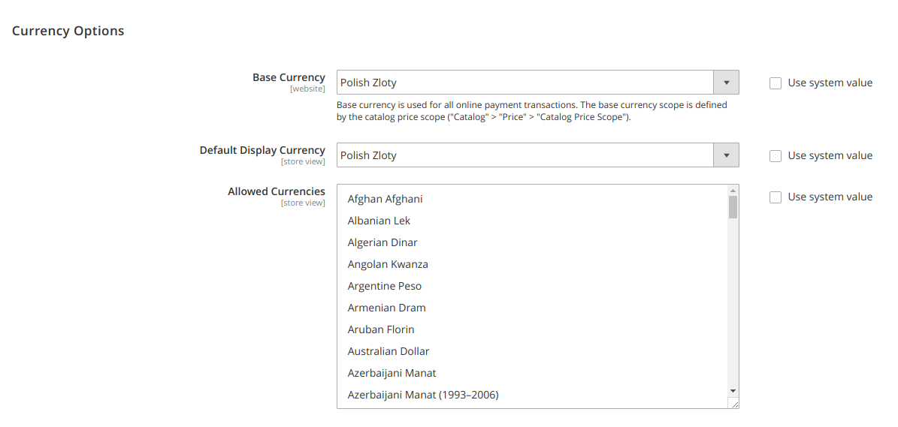
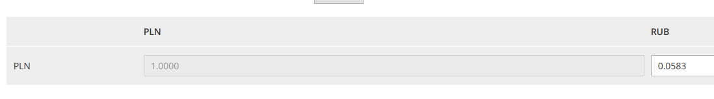

# Currency Converter

RUB to PLN available on `/currency/converter/` page.


```json
"require": {
 "bmxmale/module-currency-converter": "*",
},
"repositories": [
 {
 "type": "git",
 "url": "git@github.com:bmxmale/m2example-module-currency-converter.git"
 },
]
```

#### Configuration

##### `Stores / Configuration / Currency Setup`


Base Currency: `Polish Zloty`

Default Display Currency: `Polish Zloty`

Allowed Currencies: `Polish Zloty`, `Russian Ruble`



##### `Stores / Currency Rates`

Unfortunately in latest Magento 2.2 version each import services: `Yahoo Finance Exchange`, `Webservicex`,`Fixer.io` not working, so you need to fill data manually.

Latest rate for RUB can be checked on [NBP Exchange rates].

[NBP Exchange rates]: https://api.nbp.pl/api/exchangerates/rates/a/rub



##### `System / Cache Management`

Click button `Flush Magento Cache`